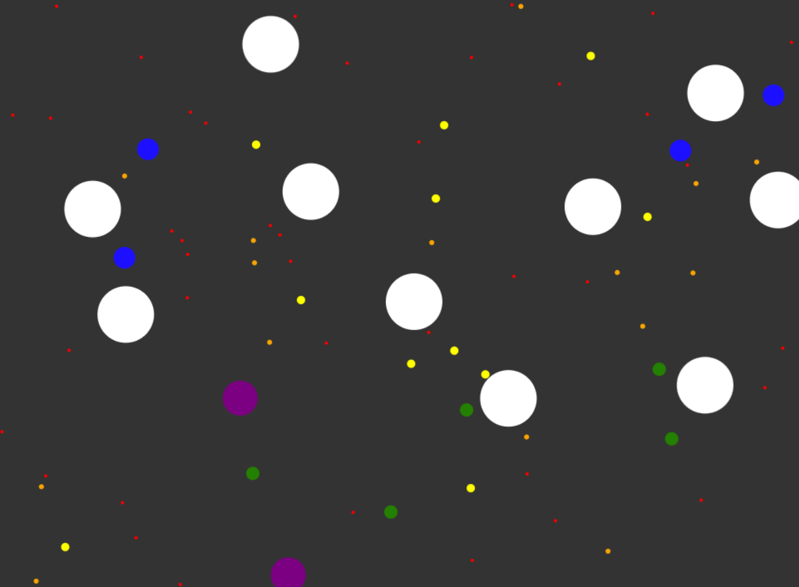

# circle-spawning-simulation

Web demo where different size/color circles spawn, eat each other, etc.

## Screenshot

## How to run

Simply open `index.html` in any browser

## Notes

AI model Claude 3.7 Sonnet did the heavy lifting. I added ideas and bug fix support.
